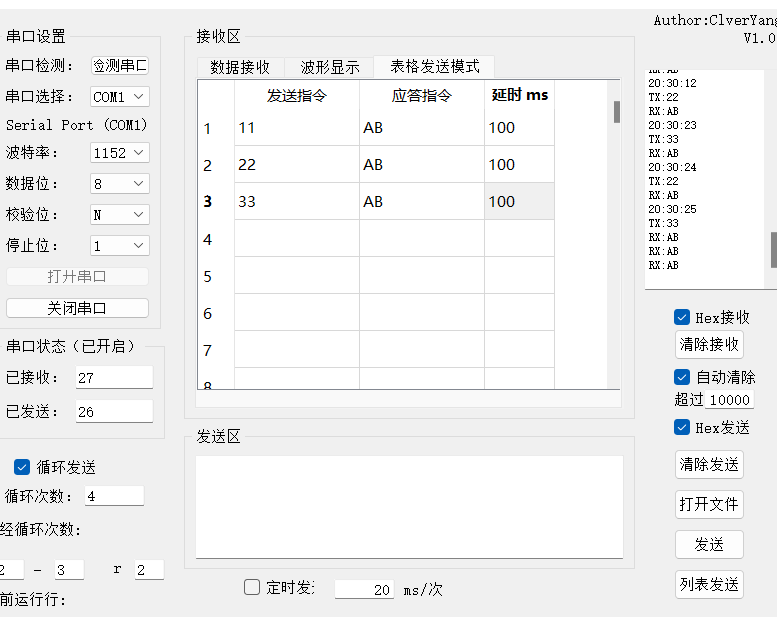

# pyqt5 build Uchartool

Program build in Pyqt5 for the queue-list conmmand for uchar channel information exchange.

My python environment:

. pyqt5

. pyqt5-tools

. pyserial

. matplotlib

. pyinstaller

. py2exe

Use following command package programing

pyinstaller -F uchar.py -w

Showing:

